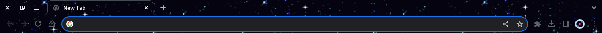
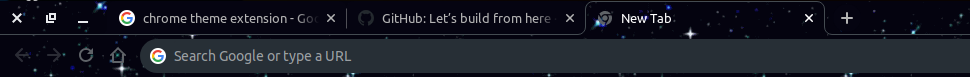

# Starry Night Chrome Theme

A dark blue Chrome theme inspired by a starry night sky.

## Installation

1. Download the theme files from the repository.
2. Open Google Chrome.
3. Go to `chrome://extensions/`.
4. Enable "Developer mode" in the top-right corner.
5. Click "Load unpacked" and select the theme files.

## Screenshots

## Credits

Theme design by Hemil Patel.

## License

This project is licensed under the MIT License - see the [LICENSE](LICENSE) file for details.
